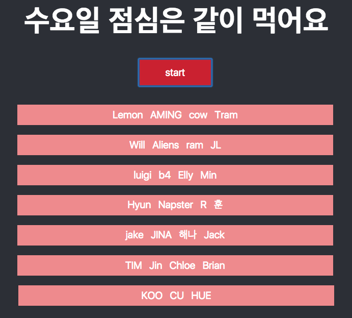

## makeLunchGroup
---
### output

### analysis

처음 구현하고자 했던 방식은 멤버 이름이 들어가 있는 배열과 한 그룹의 인원수를 인풋으로 주면,

html에서 짜여진 알고리즘에 맞게 input객체를 설정하고 각각의 id에 해당 그룹당 인원을 뿌려주고자 하였다

하지만 input id에 변수를 추가하는 방법을 해결하지 못해 두 가지 방식으로 만들었다

1. lunchMem.js

원했던 방식의 알고리즘을 짰지만, start 버튼을 누를 때 마다 input 객체가 html에 추가 생성된다

2. lunchMem0.js

output은 원했던 방식이지만, 하드코딩인 상태라 멤버 인원이 변경되거나 그룹 인원이 변경 되는 것을 반영하지 못한다
